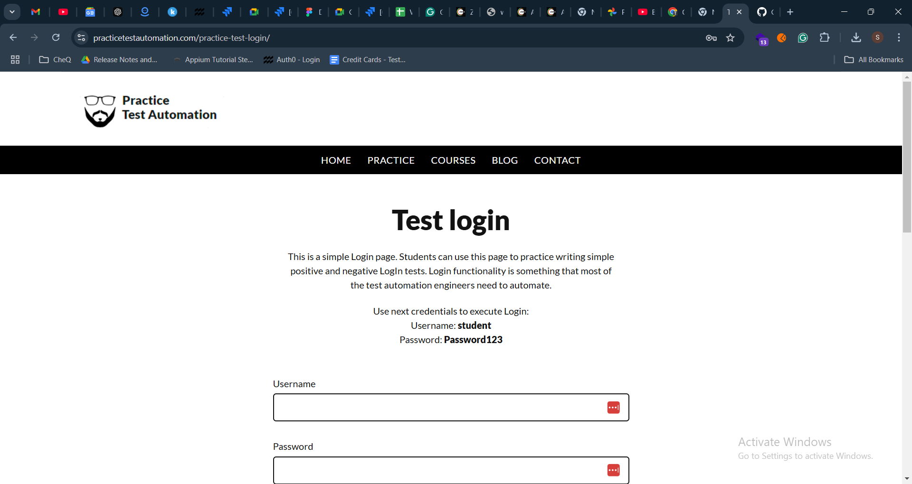

# Java Web Automation

This project demonstrates how to automate a simple web login process using Java and Selenium.

## Setup Instructions

1. Clone the repository:
   ```
   git clone https://github.com/yourusername/java-web-automation.git
   ```
2. Navigate to the project folder and compile the code:
   ```
   mvn compile
   ```
3. Run the test:
   ```
   mvn exec:java -Dexec.mainClass="com.yourusername.automation.LoginTest"
   ```

## Prerequisites

- Java 11 or higher
- Maven installed
- Chrome WebDriver downloaded and configured

## Screenshots


